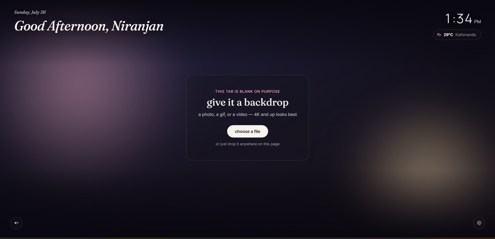
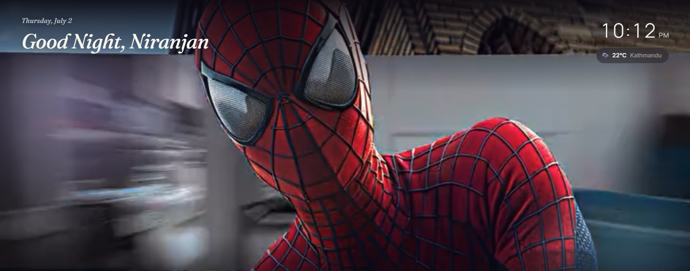
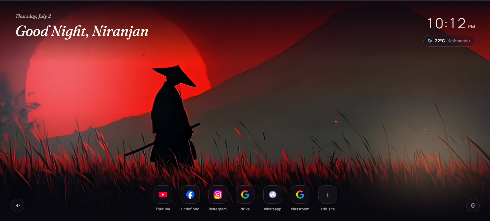

<div align="center">


<p>
  
  
  
</p>

<p>
  
  
  
  
  
</p>

<h3><i>Every new tab, a little more yours.</i></h3>

<p>
  <a href="#-features"><b>Features</b></a> ·
  <a href="#-screenshots"><b>Screenshots</b></a> ·
  <a href="#-installation"><b>Install</b></a> ·
  <a href="#-privacy"><b>Privacy</b></a> ·
  <a href="#-roadmap"><b>Roadmap</b></a>
</p>

</div>

<br/>

> Aurora turns every new tab into a calm, personal dashboard — your own photo, GIF, or video as the backdrop, with a soft glassmorphism greeting, live clock, local weather, and one-row quick links. Nothing leaves your device. No accounts, no analytics, no ads — just your tab, the way you left it.

<br/>



<br/>

## ✨ Features

<table>
<tr>
<td width="50%" valign="top">

### 🎥 Beautiful Custom Backgrounds
Set any image, GIF, or video — up to 4K — as your backdrop.
- Drag & drop support
- Replace or remove anytime
- Video sound toggle

</td>
<td width="50%" valign="top">

### 👋 A Personal Touch
A dashboard that feels like it knows you, without knowing anything about you.
- Time-based dynamic greeting
- Optional personalized name
- Soft glassmorphism interface

</td>
</tr>
<tr>
<td width="50%" valign="top">

### 🕒 Live Clock
Always right there, never in the way.
- 12-hour or 24-hour format
- Real-time updates

</td>
<td width="50%" valign="top">

### 🌤️ Local Weather
A glance at the sky before you even look outside.
- Current temperature & condition
- Location name
- °C / °F toggle
- Auto-refresh every 30 minutes

</td>
</tr>
<tr>
<td width="50%" valign="top">

### 🔗 Quick Links
Your favorite corners of the web, one click away.
- Website favicon support
- Right-click context menu
- Edit / remove shortcuts
- Clean, centered one-row layout

</td>
<td width="50%" valign="top">

### 🎨 Make It Yours
- Multiple accent colors
- Adjustable background dimming
- Show/hide Quick Links
- Every setting stored locally

</td>
</tr>
</table>

<br/>

<div align="center">

## 🔒 Privacy, by Design


**Everything Aurora knows about you lives only on your device.**
Your location is requested solely to fetch the weather — never stored, never transmitted anywhere else.

</div>

<br/>

## 🖼️ Screenshots

> Images live at the project root (or move them into a `/screenshots` folder and update the paths below).

<table>
  <tr>
    <td width="50%"><p align="center"><sub>New Tab — Custom Background & Greeting</sub></p></td>
    <td width="50%"><p align="center"><sub>Settings Panel</sub></p></td>
  </tr>
</table>

<br/>

## 📥 Installation

<div align="center">


</div>

<br/>

**Developer Mode install:**

1. Download or clone this repository, and extract it if downloaded as a ZIP
2. Open `chrome://extensions` (or `brave://extensions`, `edge://extensions`)
3. Enable **Developer Mode**
4. Click **Load unpacked**
5. Select the Aurora project folder
6. Open a new tab — done ✨

<br/>

## 🕹️ Usage

<details open>
<summary><strong>Setting a background</strong></summary>

Click **Choose a File**, or drag and drop an image, GIF, or video anywhere on the page.

**Supported formats:** JPG · PNG · WebP · GIF · MP4 · WebM · most browser-supported image/video formats

</details>

<details>
<summary><strong>Settings panel</strong></summary>

Open via the gear icon:

- Change your display name
- Replace or remove the background
- Switch °C / °F
- Toggle 12-hour / 24-hour clock
- Adjust backdrop dimming
- Change accent color
- Show or hide Quick Links

</details>

<details>
<summary><strong>Weather</strong></summary>

Aurora requests your location only to fetch the current forecast, refreshing automatically every 30 minutes (or manually via a click on the widget). Your location is never stored or sent anywhere beyond that single weather request.

</details>

<br/>

## 🗄️ How Aurora Stores Things

<div align="center">

| What | Where | Notes |
|---|---|---|
| ⚙️ Settings | Chrome Storage Sync → Local Storage fallback | Syncs across your signed-in browser instances |
| 🖼️ Background media | IndexedDB | Supports high-res images/video without hitting storage limits |

</div>

Only **one background file** is stored at a time — setting a new one automatically overwrites the last, so nothing piles up.

<br/>

## 📁 Project Structure

```
Aurora/
├── manifest.json     # Extension manifest (Manifest V3)
├── newtab.html        # Main new tab page
├── style.css           # Interface styling
├── newtab.js            # Main application logic
├── db.js                 # IndexedDB wrapper
├── icons/                 # Extension icons
└── README.md
```

<br/>

## 🧰 Technologies

<div align="center">


**APIs:** [Open-Meteo](https://open-meteo.com/) (weather) · [BigDataCloud](https://www.bigdatacloud.com/) (reverse geocoding)

</div>

<br/>

## 🌐 Browser Support

<div align="center">

✔️ Google Chrome &nbsp;·&nbsp; ✔️ Brave &nbsp;·&nbsp; ✔️ Microsoft Edge &nbsp;·&nbsp; ✔️ Vivaldi &nbsp;·&nbsp; ✔️ Opera

*Any Chromium-based browser that supports Manifest V3.*

</div>

<br/>

## ⚡ Performance

- Hardware-accelerated video playback
- Background video pauses automatically when the tab is inactive
- Efficient IndexedDB-backed media storage
- Local weather caching
- Minimal CPU usage at idle

<br/>

## 🗺️ Roadmap

- [ ] Search bar
- [ ] Bookmark folders
- [ ] Drag-and-drop quick link sorting
- [ ] Daily quotes
- [ ] Calendar widget
- [ ] Notes widget
- [ ] Animated theme packs
- [ ] More customization options

<br/>

## 🤝 Contributing

Contributions, feature requests, and bug reports are welcome.

```bash
1. Fork the repository
2. Create a feature branch
3. Commit your changes
4. Open a Pull Request
```

<br/>

## 👤 Author

<div align="center">

**Niranjan**
<br/>
*Designed and developed for a cleaner, more personal browsing experience.*

</div>

<br/>

<div align="center">

</div>
